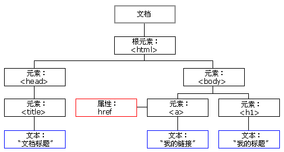

Table of Contents
=================

   * [HTML DOM](#html-dom)
      * [阅读说明](#阅读说明)
      * [参考引用](#参考引用)
      * [基本概念](#基本概念)
         * [HTML DOM](#html-dom-1)
         * [HTML DOM节点](#html-dom节点)
         * [HTML DOM 节点树](#html-dom-节点树)
         * [HTML DOM 方法与属性](#html-dom-方法与属性)
         * [HTML元素(节点)的查改增删](#html元素节点的查改增删)
         * [HTML DOM 事件](#html-dom-事件)

Created by ALTA


## 阅读说明  

*<font color=#008000>绿色斜体</font>*代表个人的思考理解，*<font color=Yellow>黄色斜体</font>*代表阅读理解过程中的疑问，<font color=Red>红色正体</font>代表关键重要信息，<u>下划线</u>代表次关键重要信息`阴影`或 *一般斜体* 均表示引用或强调 

```python
# ---------------------------------- 输出结果
```

## 参考引用  

本文引用及参考自下列文章/网站

[HTML DOM教程](https://www.w3school.com.cn/htmldom/index.asp)


## 基本概念  

DOM 是 W3C（万维网联盟）的标准，**DOM 定义了访问 HTML 和 XML 文档的标准**。W3C 文档对象模型 （DOM） 是中立于平台和语言的接口，它允许程序和脚本动态地访问和更新文档的内容、结构和样式。W3C DOM 标准被分为 3 个不同的部分：

- 核心 DOM - 针对任何结构化文档的标准模型
- XML DOM - 针对 XML 文档的标准模型
- HTML DOM - 针对 HTML 文档的标准模型

### HTML DOM  

HTML DOM 定义了所有 HTML 元素的**对象**和**属性**，以及访问它们的**方法**，<font color=Red>换言之，HTML DOM 是关于如何获取、修改、添加或删除 HTML 元素的标准</font>。

### HTML DOM节点  

**在 HTML DOM 中，所有事物都是节点。DOM 是被视为节点树的 HTML**

根据 W3C 的 HTML DOM 标准，HTML 文档中的所有内容都是节点：

- 整个文档是一个文档节点
- 每个 HTML 元素是元素节点
- HTML 元素内的文本是文本节点
- 每个 HTML 属性是属性节点
- 注释是注释节点

### HTML DOM 节点树  

通过 HTML DOM，树中的所有节点均可通过 JavaScript 进行访问。所有 HTML 元素（节点）均可被修改，也可以创建或删除节点。  



### HTML DOM 方法与属性 

**方法是我们可以在节点（HTML 元素）上执行的动作**

可通过 JavaScript （以及其他编程语言）对 HTML DOM 进行访问。所有 HTML 元素被定义为对象，而编程接口则是对象方法和对象属性。

方法是您能够执行的动作（比如添加或修改元素）。

属性是您能够获取或设置的值（比如节点的名称或内容）

### HTML元素(节点)的查改增删  

详细方法可参考： [DOM Element对象](<https://www.w3school.com.cn/jsref/dom_obj_all.asp>)

1. 访问HTML元素(节点)-查

   访问 HTML 元素等同于访问节点

   - 通过使用 getElementById() 方法
   - 通过使用 getElementsByTagName() 方法
   - 通过使用 getElementsByClassName() 方法

2. 修改HTML元素-改

   修改元素主要包含以下两方面内容：

   - 改变HTML元素内容
   - 改变HTML元素属性(包含改变CSS样式，因为CSS样式本就是一种特殊属性)
   - 改变事件<font color=yellow>(todo 理解一下这个)</font>

3. 创建HTML元素-增

   如需向 HTML DOM 添加新元素，首先必须创建该元素（元素节点），然后把它追加到已有的元素上。

   ```html
   <div id="d1">
   <p id="p1">This is a paragraph.</p>
   <p id="p2">This is another paragraph.</p>
   </div>
   
   <script>
   var para=document.createElement("p");
   var node=document.createTextNode("This is new.");
   para.appendChild(node);
   
   var element=document.getElementById("d1");
   element.appendChild(para);
   </script>
   ```

4. 删除HTML元素-删

   如需删除 HTML 元素，必须清楚该元素的父元素：

   ```html
   <div id="div1">
   <p id="p1">This is a paragraph.</p>
   <p id="p2">This is another paragraph.</p>
   </div>
   <script>
   var parent=document.getElementById("div1");
   var child=document.getElementById("p1");
   parent.removeChild(child);
   </script>
   ```

### HTML DOM 事件  

当事件发生时，可以执行 JavaScript，比如当用户点击一个 HTML 元素时。如需在用户点击某个元素时执行代码，请把 JavaScript 代码添加到 HTML 事件属性中。<font color=green>事件句柄是HTML元素的属性，即HTML有一类特殊的属性，该种属性可以触发一定行为，可以使JavaScript的程序，也可以是DOM的各种方法。</font>

实例1

```html
<!DOCTYPE html>
<html>
<body>
<h1 onclick="this.innerHTML='hello!'">请点击这段文本!</h1>
</body>
</html>
```

实例2

```html
<!DOCTYPE html>
<html>
<head>
<script>
function changetext(id)
{
id.innerHTML="hello!";
}
</script>
</head>
<body>
<h1 onclick="changetext(this)">请点击这段文本!</h1>
</body>
</html>
```

分配事件的方法：

- 通过设置元素属性分配事件

  ```html
  <button onclick="displayDate()">试一试</button>
  ```

- 通过JavaScript向HTML元素分配事件

  ```html
  <script>
  document.getElementById("myBtn").onclick=function(){displayDate()};
  </script>
  ```

  