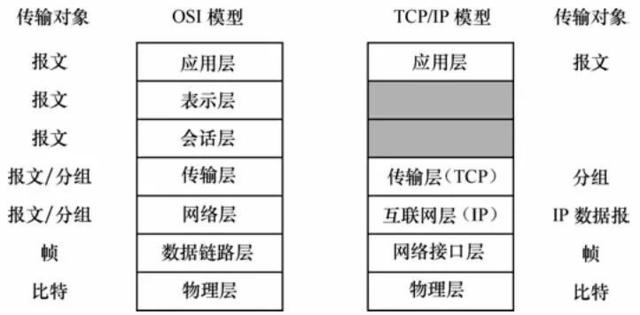

Table of Contents
=================

   * [TCP/IP](#tcpip)
      * [参考引用](#参考引用)
      * [基本概念](#基本概念)
         * [协议](#协议)
         * [TCP/IP](#tcpip-1)
         * [TCP/IP分层](#tcpip分层)
         * [TCP](#tcp)
         * [IP](#ip)

Created by ALTA
# TCP/IP  
<font color=#008000>绿色字体</font>代表个人的思考理解，<font color=Yellow>黄色字体</font>代表阅读理解过程中的疑问，<font color=Red>红色字体</font>代表关键重要信息，<u>下划线</u>代表次关键重要信息，`阴影`或 *一般斜体* 均表示引用或强调 

```python
# ---------------------------------- 输出结果
```

## 参考引用  

本文引用及参考自下列文章/网站， 版权归属原作者所有：

1. 

## 基本概念  

### 协议  

计算机和网络设备之间相互通信事先制定的规则。这些规则即被称为<font color=Red>协议</font>,即协议是一组规则.

### TCP/IP  

不同的语境下TCP/IP指代有所不同，使用比较广泛的是如下几种含义：

1. TCP/IP参考模型.类似于OSI标准模型的一种网络体系结构
2. TCP协议，IP协议
3. 以TCP协议、IP协议为主的与互联网相关联的协议族的统称

### TCP/IP分层  

TCP/IP参考模型包含如下分层：



1. 应用层包含的主要协议：

   包含的主要协议有文件传输协议（File Transfer Protocol，FTP）、简单邮件传送协议（Simple Mail Transfer Protocol， SMTP）、远程登录协议、域名服务协议（Domain Name Service，DNS）、网络新闻传送协议（Network News Transfer Protocol，NNTP）和超文本传输协议（Hyper Text Transfer Protocol，HTTP）

2. 传输层包含的主要协议：

   基本字节的面向连接应用层的传输TCP协议，TCP为应用程序之间的数据传输提供可靠连接；面向无连接的用户数据报UDP协议，UDP的传送不保证数据一不到达目的地，也不保证数据报的顺序，不提供重传机制；提供声音传送服务的NVP协议

3. 互联网层包含的主要协议：

   互联网层对应于 OSI 模型的网络层。该层采用的协议称为互联网协议，它提供跨多个网络的寻址选路功能，使IP数据（带有IP地址）从一个网络的主机传到另一网络的主机。包括的协议有网际IP协议；网际控制报文协议ICMP；将IP地址转换成物理网层地址的ARP协议；将物理网地址转换成IP地址的RARP协议

4. 网络接口层/数据链路层包含的主要协议：

   网络接口层对应于OSI模型的数据链路层。接口层负责与物理传输的连接媒介打交道，主要功能是接收数据报，并把接收到的数据报发送到指定的网络中去。该层需要执行不同协议的局域网，通过网关实现协议与TCP/IP的转换，使数据穿过多个互联的网络正确地传输，实现异种网络接入Internet。(DSL SONET 802.11 Ethernet等)

### TCP  

TCP位于传输层， <font color=Red>提供可靠的字节流服务</font>，为保证可靠性包含如下两方面内容：

1. 大块数据分割成报文段
2. 三次握手以确认数据送达


### IP  

IP位于网络层，<font color=Red>提供网络传送服务服务，把各种数据包传送给对方</font>， 为实现传送包含如下内容：IP地址和MAC地址